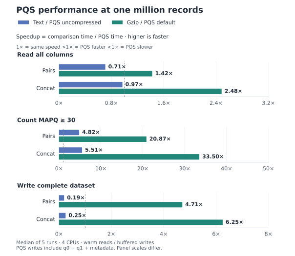
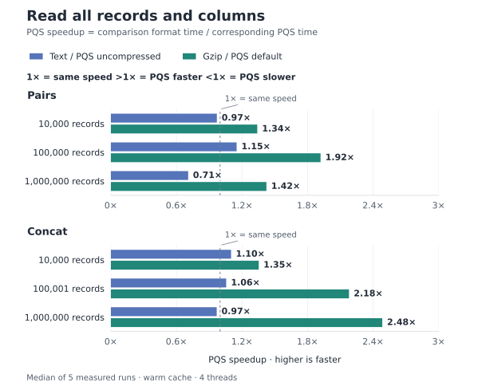
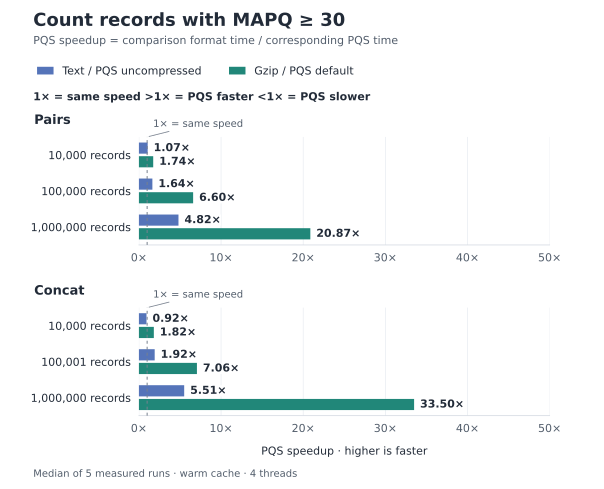
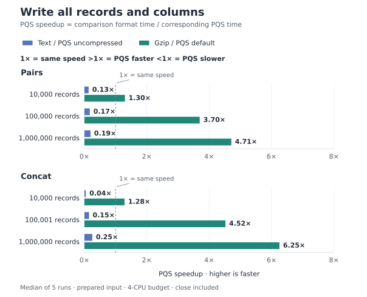
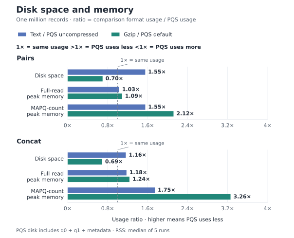
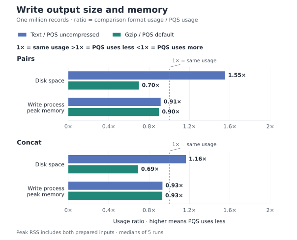

# PQS format

PQS stores genomic contacts in a **directory of Parquet files and metadata**.
It supports **selective column reads, fast quality filtering and efficient
compressed writing**. In our [one-million-record benchmark](#performance-benchmark),
default PQS delivered **20.87–33.50× faster MAPQ ≥ 30 counts** and
**4.71–6.25× faster writes** than gzip text.

Pass the whole directory to pqsio, for example `sample.pairs.pqs`.

## Two kinds of dataset

| Kind | Format version | One row represents | Typical use |
| --- | --- | --- | --- |
| **pairs** | `0.1.0` | A contact between two genomic positions | Hi-C contacts or pairwise contacts expanded from long reads |
| **concat** | `0.2.0` | One alignment belonging to a read | Preserve multiple alignments per long read / Pore-C read |

The dataset kind and format version are recorded in `_metadata`. They are
independent of the pqsio software version. Names such as `.pairs.pqs` and
`.concat.pqs` help identify datasets; the metadata determines their kind.

## Directory layout

A small dataset looks like this:

```text
sample.pairs.pqs/
├── _contigsizes       # Ordered contig names and lengths in bp
├── _metadata          # Dataset kind, format version, columns and types
├── _metadata_counts   # Record counts for each quality partition
├── _readme            # Short description of the quality partitions
├── q0/                # All records
│   ├── 0.parquet
│   └── 1.parquet
└── q1/                # Records with MAPQ >= 1
    └── 0.parquet
```

Each Parquet file is a shard of the dataset. Shard numbers can have gaps in
`q1` when a shard has no qualifying records. Empty datasets have both quality
directories but no Parquet files. Keep the metadata and shards together when
moving or copying a dataset.

`_contigsizes` is a two-column, tab-separated table of contig name and length.
Its row order defines the numeric contig IDs used by the API.
`_metadata` uses a Python-dictionary representation, including dtype names;
it is not JSON. Use `pqsio inspect` to read it as a structured report.

Optional files include `cn.info` for [copy numbers](copy-numbers.md),
`.pqsio-index/` for [region indexes](query.md), and import/merge provenance.
They do not change the core record columns.

## What do q0 and q1 mean?

- **q0 contains every record**, including MAPQ 0.
- **q1 contains the subset with MAPQ >= 1**. It uses `mapq` for pairs and
  `mapping_quality` for concat.
- **Do not add q0 and q1 counts.** If q0 has 100 records and q1 has 80,
  the dataset contains 100 records.

Use `min_mapq` in the API or `--min-mapq` in the CLI to select a threshold.
For concat, filtering can remove some alignments of a read or the entire read.
Use [complete-read queries](query.md) when you need all alignments of reads
that match a filter.

`_metadata_counts` contains `q0_records` and `q1_records`. Concat also has
`q0_concats` and `q1_concats`, counting reads with at least one alignment in
the respective partition. A concat record count is an **alignment count**.

## Pairs columns

Types below use the Polars names recorded in `_metadata`. `Categorical`
columns store text values such as chromosome names and strands.

| Column(s) | Type | Meaning |
| --- | --- | --- |
| `read_idx` | String | Read/contact identifier; leading zeros are preserved |
| `chrom1`, `chrom2` | Categorical | Contig names for the two contact endpoints |
| `pos1`, `pos2` | UInt32 or UInt64 | **1-based** positions within those contigs |
| `strand1`, `strand2` | Categorical | `+` or `-` for each endpoint |
| `mapq` | UInt8 | Stored contact mapping quality, 0–255 |

For example, `chrom1=chr1, pos1=10, chrom2=chr1, pos2=200` describes a
contact between bases 10 and 200 of chr1.

The on-disk string column **`read_idx`** is named **`read_id`** in Python's
`Pair` object and **`readID`** in text previews/exports. API `chrom1` and
`chrom2` values are zero-based contig indexes, while disk/text values are names.
Positions use UInt32 when all contig lengths fit; otherwise they use UInt64.

## Concat columns

| Column(s) | Type | Meaning |
| --- | --- | --- |
| `read_idx` | UInt64 | Integer read identifier shared by all alignments of a read |
| `read_length` | UInt32 | Length of the original read in bp |
| `read_start`, `read_end` | UInt32 | **0-based, half-open** interval on the read |
| `strand` | Categorical | Alignment strand, `+` or `-` |
| `chrom` | Categorical | Reference contig name; the API uses its numeric index |
| `start`, `end` | UInt64 | **0-based, half-open** interval on the reference |
| `mapping_quality` | UInt8 | Alignment MAPQ, 0–255 |
| `identity` | Float32 | Alignment identity value, typically a fraction such as `0.99` |
| `filter_reason` | Categorical | Alignment filter label, such as `pass` |

New pqsio datasets use global read IDs (`read_idx_scope='global'`). Writers
accept complete reads in strictly increasing ID order and keep each read's
alignments together in a shard. A large read may exceed the target shard size.
Older datasets with shard-local IDs are handled by the reader; see
[storage and compatibility](storage.md).

## Coordinates at a glance

| Context | Convention | Example |
| --- | --- | --- |
| Pairs `pos1`, `pos2` | 1-based | Position `1` is the first base |
| Concat reference and read intervals | 0-based, half-open | `[0, 100)` covers the first 100 bases |
| CLI/API query and subset regions, for either kind | 0-based, half-open | `chr1:0-100` selects the first 100 bases |

Direct BAM/PAF-to-pairs conversion uses 1-based leftmost positions by default;
concat-to-pairs uses reference midpoints. See [conversion rules](api.md#conversion-modes-and-coordinates)
when choosing a conversion route.

## Compression

Choose compression when opening a [writer](python.md#choose-compression).
The setting applies to every q0 and q1 shard, for both pairs and concat.

| `compression` | `compression_level` |
| --- | --- |
| `zstd` (default) | 1–22, or omit for the codec default |
| `gzip` | 0–9, or omit for the codec default |
| `brotli` | 0–11, or omit for the codec default |
| `snappy` | Omit; no level option |
| `lz4` | Omit; uses Parquet LZ4_RAW |
| `uncompressed` | Omit; disables page compression |

Higher levels generally spend more CPU to reduce file size; measure with your
own data. `uncompressed` still uses Parquet encodings and stores q0 and q1.
Gzip here compresses Parquet pages; it does not produce a `.pairs.gz` text file.
Readers detect compression from each Parquet file, with no reader option or
PQS format-version change needed.

## Performance benchmark

At one million records, default PQS writes **4.71–6.25× faster** and counts
MAPQ ≥ 30 records **20.87–33.50× faster** than Gzip. Uncompressed PQS speeds up
quality counts, but full reads and writes remain slower than Text at this scale.

**Blue:** Text / uncompressed PQS. **Green:** Gzip level 6 / default PQS.
**1× means equal speed; higher is faster for PQS.** Medians of five runs.

[](assets/benchmarks/format-overview.svg)

??? info "Detailed results: all sizes, storage and memory"

    All sizes use the same records across formats: 10,000, 100,000 and 1,000,000
    rows (100,001 at the middle concat scale to preserve complete reads).
    Full reads normalize logical column types; quality counts project one column
    and use PQS q1. Writes include q0, q1, metadata and finish, excluding input preparation.

    **Read all columns**

    

    **Count MAPQ ≥ 30**

    

    **Write a complete dataset**

    

    **Storage and memory at one million records**

    Usage ratios are Text or Gzip usage divided by the corresponding PQS usage:
    **above 1× means PQS uses less**. PQS size includes q0, q1 and metadata.
    Gzip uses less disk space than default PQS. Write-process RSS includes both
    prepared inputs and native libraries, not just writer buffers.

    

    

    Download [read measurements (CSV)](assets/benchmarks/format-summary.csv) and
    [write measurements (CSV)](assets/benchmarks/format-write-summary.csv).

<!-- benchmark-tables:start -->

??? info "Exact measurements and ratios"

    Times are in milliseconds; disk and peak RSS are in MiB (2²⁰ bytes).
    Ratios are calculated from unrounded medians. Each row names its PQS baseline.

    **Read all records and columns**

    | Dataset | Records | Comparison | Text / Gzip (ms) | PQS (ms) | PQS speedup |
    | --- | ---: | --- | ---: | ---: | ---: |
    | pairs | 10,000 | Text / PQS uncompressed | 2.36 | 2.43 | **0.97×** |
    | pairs | 10,000 | Gzip / PQS default | 3.79 | 2.83 | **1.34×** |
    | pairs | 100,000 | Text / PQS uncompressed | 8.81 | 7.66 | **1.15×** |
    | pairs | 100,000 | Gzip / PQS default | 16.29 | 8.49 | **1.92×** |
    | pairs | 1,000,000 | Text / PQS uncompressed | 56.29 | 79.54 | **0.71×** |
    | pairs | 1,000,000 | Gzip / PQS default | 123.28 | 86.58 | **1.42×** |
    | concat | 10,000 | Text / PQS uncompressed | 3.06 | 2.78 | **1.10×** |
    | concat | 10,000 | Gzip / PQS default | 4.07 | 3.01 | **1.35×** |
    | concat | 100,001 | Text / PQS uncompressed | 10.32 | 9.78 | **1.06×** |
    | concat | 100,001 | Gzip / PQS default | 25.79 | 11.83 | **2.18×** |
    | concat | 1,000,000 | Text / PQS uncompressed | 70.44 | 72.71 | **0.97×** |
    | concat | 1,000,000 | Gzip / PQS default | 218.21 | 87.84 | **2.48×** |

    **Count records with MAPQ ≥ 30**

    | Dataset | Records | Comparison | Text / Gzip (ms) | PQS (ms) | PQS speedup |
    | --- | ---: | --- | ---: | ---: | ---: |
    | pairs | 10,000 | Text / PQS uncompressed | 2.22 | 2.08 | **1.07×** |
    | pairs | 10,000 | Gzip / PQS default | 3.62 | 2.08 | **1.74×** |
    | pairs | 100,000 | Text / PQS uncompressed | 4.09 | 2.50 | **1.64×** |
    | pairs | 100,000 | Gzip / PQS default | 17.02 | 2.58 | **6.60×** |
    | pairs | 1,000,000 | Text / PQS uncompressed | 21.21 | 4.40 | **4.82×** |
    | pairs | 1,000,000 | Gzip / PQS default | 91.34 | 4.38 | **20.87×** |
    | concat | 10,000 | Text / PQS uncompressed | 2.14 | 2.33 | **0.92×** |
    | concat | 10,000 | Gzip / PQS default | 4.01 | 2.21 | **1.82×** |
    | concat | 100,001 | Text / PQS uncompressed | 5.10 | 2.65 | **1.92×** |
    | concat | 100,001 | Gzip / PQS default | 22.75 | 3.22 | **7.06×** |
    | concat | 1,000,000 | Text / PQS uncompressed | 27.47 | 4.98 | **5.51×** |
    | concat | 1,000,000 | Gzip / PQS default | 181.47 | 5.42 | **33.50×** |

    **Write a complete dataset**

    | Dataset | Records | Comparison | Text / Gzip (ms) | PQS (ms) | PQS speedup |
    | --- | ---: | --- | ---: | ---: | ---: |
    | pairs | 10,000 | Text / PQS uncompressed | 4.17 | 30.94 | **0.13×** |
    | pairs | 10,000 | Gzip / PQS default | 43.33 | 33.36 | **1.30×** |
    | pairs | 100,000 | Text / PQS uncompressed | 10.23 | 59.34 | **0.17×** |
    | pairs | 100,000 | Gzip / PQS default | 281.05 | 76.03 | **3.70×** |
    | pairs | 1,000,000 | Text / PQS uncompressed | 68.43 | 352.27 | **0.19×** |
    | pairs | 1,000,000 | Gzip / PQS default | 2632.90 | 559.01 | **4.71×** |
    | concat | 10,000 | Text / PQS uncompressed | 1.40 | 31.82 | **0.04×** |
    | concat | 10,000 | Gzip / PQS default | 48.05 | 37.39 | **1.28×** |
    | concat | 100,001 | Text / PQS uncompressed | 10.22 | 69.16 | **0.15×** |
    | concat | 100,001 | Gzip / PQS default | 483.38 | 106.93 | **4.52×** |
    | concat | 1,000,000 | Text / PQS uncompressed | 90.04 | 357.43 | **0.25×** |
    | concat | 1,000,000 | Gzip / PQS default | 4907.09 | 784.94 | **6.25×** |

    **Storage and read memory at one million records**

    | Dataset | Metric | Comparison | Text / Gzip (MiB) | PQS (MiB) | Usage ratio |
    | --- | --- | --- | ---: | ---: | ---: |
    | pairs | Disk space | Text / PQS uncompressed | 49.16 | 31.66 | **1.55×** |
    | pairs | Disk space | Gzip / PQS default | 10.05 | 14.37 | **0.70×** |
    | pairs | Full-read peak RSS | Text / PQS uncompressed | 218.07 | 211.48 | **1.03×** |
    | pairs | Full-read peak RSS | Gzip / PQS default | 233.30 | 214.14 | **1.09×** |
    | pairs | MAPQ-count peak RSS | Text / PQS uncompressed | 108.27 | 69.69 | **1.55×** |
    | pairs | MAPQ-count peak RSS | Gzip / PQS default | 151.96 | 71.72 | **2.12×** |
    | concat | Disk space | Text / PQS uncompressed | 65.05 | 55.88 | **1.16×** |
    | concat | Disk space | Gzip / PQS default | 22.96 | 33.20 | **0.69×** |
    | concat | Full-read peak RSS | Text / PQS uncompressed | 230.00 | 195.32 | **1.18×** |
    | concat | Full-read peak RSS | Gzip / PQS default | 249.27 | 201.44 | **1.24×** |
    | concat | MAPQ-count peak RSS | Text / PQS uncompressed | 124.82 | 71.53 | **1.75×** |
    | concat | MAPQ-count peak RSS | Gzip / PQS default | 230.93 | 70.86 | **3.26×** |

    **Write output size and memory at one million records**

    | Dataset | Metric | Comparison | Text / Gzip (MiB) | PQS (MiB) | Usage ratio |
    | --- | --- | --- | ---: | ---: | ---: |
    | pairs | Disk space | Text / PQS uncompressed | 49.16 | 31.66 | **1.55×** |
    | pairs | Disk space | Gzip / PQS default | 10.05 | 14.37 | **0.70×** |
    | pairs | Write-process peak RSS | Text / PQS uncompressed | 281.72 | 308.07 | **0.91×** |
    | pairs | Write-process peak RSS | Gzip / PQS default | 281.04 | 312.87 | **0.90×** |
    | concat | Disk space | Text / PQS uncompressed | 65.05 | 55.88 | **1.16×** |
    | concat | Disk space | Gzip / PQS default | 22.96 | 33.20 | **0.69×** |
    | concat | Write-process peak RSS | Text / PQS uncompressed | 293.08 | 314.35 | **0.93×** |
    | concat | Write-process peak RSS | Gzip / PQS default | 292.60 | 314.37 | **0.93×** |

<!-- benchmark-tables:end -->

??? info "Method, environment and verification"

    - **Data:** nested prefixes of real pairs and concat datasets, not independent
      random samples or a whole-dataset benchmark. Concat prefixes extend to
      the final complete read. Stable sorting by the original `read_idx`
      normalizes historical ID ordering without changing IDs or alignment fields.
    - **Equivalent outputs:** all variants are written from the same prepared
      columns with the same code paths in the read and write tests. PQS uses
      native synchronous `write_columns` with a 100,000-row shard target;
      Text uses Polars TSV serialization, and Gzip serializes the same TSV
      into a gzip level-6 stream. Pairs text includes chromosome headers.
      Uncompressed PQS retains Parquet encoding and both quality partitions.
    - **Environment:** AMD EPYC 7713 64-Core Processor, Linux x86-64,
      Python 3.11.16, pqsio 0.2.0, Python Polars 0.20.29 and native Rust
      Polars 0.49.1. Fresh workers are pinned to CPUs 0–3 with four
      Polars/Rayon threads. This is a shared machine.
    - **Repetitions:** one untimed warmup and five measured runs per combination,
      with shuffled execution order. Report the median; the CSV also retains
      minimum and maximum times. No significance or confidence-interval claims.
    - **Reads:** the same Polars eager readers and explicit logical schemas for
      every variant. The parent warms input files before each fresh worker;
      caches are not flushed. Opening, parsing, decoding, type normalization
      and the requested operation are timed. Imports and verification are excluded.
    - **Writes:** every worker first prepares both a Polars DataFrame and
      equivalent native column buffers. Both stay resident regardless of writer.
      Opening, serialization, compression, closing and final publication are timed;
      input preparation and read-back are excluded. No `fsync` is called.
    - **Memory:** process peak RSS is sampled before verification. It includes
      Python, native libraries and, for writes, prepared inputs. It excludes the
      filesystem page cache and is not an isolated buffer-allocation measurement.
    - **Correctness:** every PQS fixture and output passes full native validation.
      Every full read and written output is checked with an ordered, all-field
      SHA-256 hash; filtered counts match across variants. Stored q1 contents
      are independently checked against the input's MAPQ ≥ 1 subset.
    - **Limits:** these results measure the stated readers and writers on these
      subsets. They do not cover CLI startup, indexed queries, cold-disk reads
      or full conversion pipelines. Small-input differences are a few milliseconds;
      workload, reader version and quality retention affect the results.

??? info "Reproduce the benchmark"

    Replace the input paths with your pairs and concat PQS directories. Use new
    report filenames for each run; existing reports are never overwritten.

    ```sh
    pixi run build
    pixi run --locked python scripts/format_bench.py \
      --pairs-input /path/to/sample.pairs.pqs \
      --concat-input /path/to/sample.concat.pqs \
      --sizes 10000 100000 1000000 --threads 4 --repetitions 5 \
      --report tests/output/format-compression/read.json

    pixi run --locked python scripts/format_write_bench.py \
      --pairs-input /path/to/sample.pairs.pqs \
      --concat-input /path/to/sample.concat.pqs \
      --sizes 10000 100000 1000000 --threads 4 --repetitions 5 \
      --report tests/output/format-compression/write.json
    ```

    Run read and write benchmarks sequentially. Temporary datasets and outputs
    are removed. JSON retains all measurements, data checksums, environment,
    source metadata hashes and script/native-library fingerprints. Published
    CSV files omit source names and local paths. See [documentation maintenance](documentation.md#benchmark-records)
    to regenerate the figures and exact-value tables.

## Inspect a dataset

After [installation](installation.md), replace the path with your dataset:

```sh
pixi run pqsio info sample.pairs.pqs          # Kind, version and counts
pixi run pqsio head sample.pairs.pqs -n 5     # Preview records as text
pixi run pqsio inspect sample.pairs.pqs      # Structured metadata report
pixi run pqsio validate sample.pairs.pqs --level full
```

Continue with the [Python API](python.md) or [CLI guide](cli.md).
For writer publication rules and legacy compatibility, see [storage contracts](storage.md).
